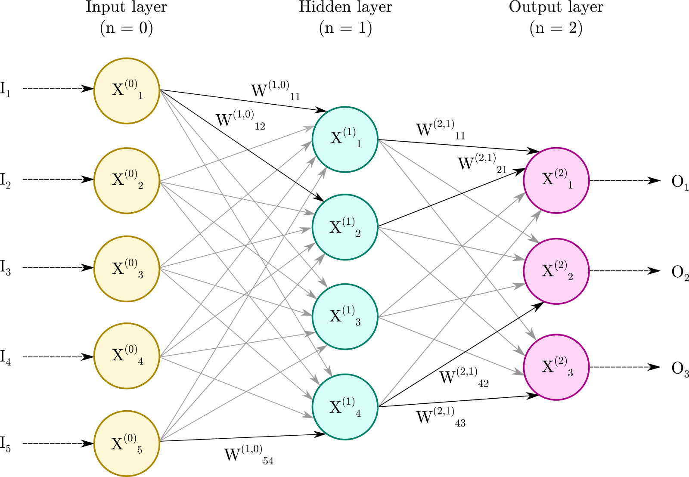
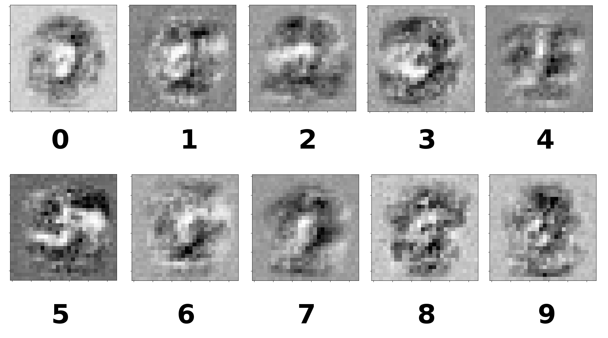

# My Own Neural Network

This program provides a class for a simple neural network consisting of one input layer, one hidden layer and one output layer, each with an arbitrary amount of nodes. As a sample implementation, the network supports training from the MNIST database and testing against it as well as saving the trained weight matrices to CSV files or loading previously trained weight matrices, saved as CSV files, into the neural network. Finally, it provides a simple plot function to plot the characters from the MNIST database and a back-query to plot reconstructed pseudo-input data by backfeeding expected output through the trained network.

The development of this program follows the book [Make Your Own Neural Network](https://books.google.de/books/about/Make_Your_Own_Neural_Network.html?id=Zli_jwEACAAJ) by [Tariq Rashid](https://github.com/makeyourownneuralnetwork).

## Program information

**Copyright** Copyright (C) 2020, Dr. Marcel Krause

**License** GNU General Public License (GNU GPL-3.0-or-later). This work is released under GNU General Public License (GNU GPL-3.0-or-later). This program is free software: you can redistribute it and/or modify it under the terms of the GNU General Public License as published by the Free Software Foundation, either version 3 of the License, or any later version. This program is distributed in the hope that it will be useful, but WITHOUT ANY WARRANTY; without even the implied warranty of MERCHANTABILITY or FITNESS FOR A PARTICULAR PURPOSE. See the GNU General Public License for more details. You have received a copy ([LICENSE.md](LICENSE.md)) of the GNU General Public License along with this program.

**Changelog** For a documentation about the changes made in this program, check the [Changelog.md](Changelog.md) file.

**MNIST data sets** The MNIST data sets required for the training and performance check of this neural network are **not** part of this repository but can be obtained in a convenient CSV format from [https://pjreddie.com/projects/mnist-in-csv/](https://pjreddie.com/projects/mnist-in-csv/).

## Short General Description of the Artificial Neural Network
### General Description of the Network and Network Queries

The artificial neural network provided by this program consists of one input layer with ") nodes, one hidden layer with ") nodes and one output layer with ") nodes. The following description is valid for networks with an arbitrary amount of hidden layers , however. Moreover, the neural network consists of weight matrices } \in \mathbb{R}^{d(n) \times d(n-1)}") which connect all nodes from the  layer with those from the ^\text{th}") layer. With } \in (0,1)^{d(n)}"), we denote the ")-dimensional vector which contains the ") values of all nodes of the  layer. The domain ") for all nodes is chosen for convenience in order to avoid a saturation of the network.

The arbitrary input values are provided as an input vector }"). This input vector is rescaled component-wise to the domain which is used throughout all nodes by the component-wise function ") as } = f_i(\textbf{I})"), which specifies the values of all nodes in the input layer.

The values of the nodes in all subsequent layers are calculated by the matrix product } = \sigma \left( \textbf{W}^{(n,n-1)} \textbf{X} ^{(n-1)} \right)"), where ") denotes the activation function. In our case, we choose the sigmoid function  = \left( 1 + e^{-x} \right) ^{-1}") as the activation function.

The values of the nodes in the last layer  are finally rescaled to the target domain, e.g. , by the component-wise function  \rightarrow \mathbb{R}") as })").

A full network query is performed by providing the input vector , feeding it through the network and by rescaling the node values of the last layer to the target domain which yields the output vector , as described above.

### Back-Query of the Network
In order to peek into the mind of the neural network, this program provides a back-query of the (trained) network by inverting all relations described in the previous section. By providing a desired output value as input, the back-query allows to reconstruct the image of the output value which the network has through the process of training.

The input values are provided as the output vector  which is rescaled to the node domain of the final layer  by the function ") as } = f_i(\textbf{O})").

The values of all nodes in the previous layers are computed by the matrix product 

} = f_i \left( \left( \textbf{W}^{(n,n-1)} \right) ^T \sigma  ^{-1} \left( \textbf{X}^{(n)} \right)  \right)")

where  \rightarrow \mathbb{R}") denotes the inverse activation function which in our case is given by the logit function
 = \ln \left( \frac{x}{1-x} \right)").
Since the hereby calculated values of the logit function may lie outside the node domain, we additionally perform a rescaling back to the node domain after each step.

The output values  calculated after the input layer are finally given by rescaling the values of the nodes at the input layer to the target domain by the component-wise function  as })").

The following image is an example of the back-query created by this code after having trained the network against the MNIST data set:

### Initialization of the Network
During the initialization of the network, the values of all weight matrices } \in \mathbb{R}^{d(n) \times d(n-1)}") are randomly determined from a normal distribution with mean value at zero and a standard deviation of }") in order to avoid a saturation of the network.

### Training the Network
For training the network, pairs of input and target output values (i.e. data known to be true) are used. For example, given the input vector , the input is connected to an expected target output }") at the  layer, i.e. the desired value which the network shall output when the input  is provided. 

In a first step, the input  is given and fed through the network, yielding the output . The error is then given by } = \textbf{T} - \textbf{O}"). This error is then back-propagated through all layers of the network in subsequent steps as } = \left(\textbf{W}^{(n,n-1)} \right) ^T \textbf{E} ^{(n)}").

The weights are updated by minimizing the error function at each layer. This leads to the update of the weight matrices as } \rightarrow \textbf{W}^{(n,n-1)} + \Delta \textbf{W}^{(n,n-1)}"), where the weight matrix update is given by
} \circ \sigma (\textbf{X}^{(n)}) \circ \left( 1 - \sigma (\textbf{X}^{(n)}) \right) \right) \left( \sigma (\textbf{X}^{(n)}) \right) ^T")
where  is the learning rate of the network and  denotes the [Hadamard product](https://en.wikipedia.org/wiki/Hadamard_product_(matrices)).

In order to improve the performance of the network, the beforementioned steps can be repeated one or more times, with each repetition being referred to as an epoch.